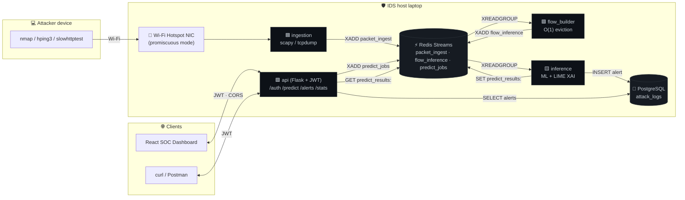

<div align="center">

# 🛡️ RT-AI-IDS

### Real-Time AI Intrusion Detection System

*Asynchronous, microservices-based IDS with Explainable AI — built for live network defense.*

[](https://github.com/Abdalkadershmaa/RT-AI-IDS/actions/workflows/ci.yml)
[](https://www.python.org/)
[](https://docs.docker.com/compose/)
[](https://redis.io/docs/data-types/streams/)
[](https://www.postgresql.org/)
[](https://flask.palletsprojects.com/)
[](https://scikit-learn.org/)
[](https://www.tensorflow.org/)
[](https://github.com/marcotcr/lime)
[](https://bandit.readthedocs.io/)
[](https://docs.astral.sh/ruff/)
[](https://github.com/psf/black)

[Quick Start](#-quick-start) · [Architecture](#-architecture) · [Live Demo Guide](#-live-attack-simulation-demo) · [API Docs](docs/api.md) · [Threat Model](docs/threat-model.md)

</div>

---

## ✨ Overview

**RT-AI-IDS** captures live network traffic, transforms it into bidirectional flow features, and uses a machine-learning model to classify each flow as benign or malicious — in real time, without ever blocking the API.

It is **not a single Flask script**. It is a small, production-style **microservices system**:

| 🏗️  Microservices                | 🚀 Async-First                  | 🔍 Explainable AI                  |
| -------------------------------- | ------------------------------ | --------------------------------- |
| Five independently scalable services connected via **Redis Streams** with consumer groups, ACK, and dead-letter semantics. Workers can crash mid-flight and a peer picks up where they left off. | The HTTP API never inlines model inference. `POST /predict` enqueues a job and returns `202 + job_id` in **<120 ms p95** under 100-way concurrency. The browser polls until ready. | The model is loaded **once per process** as a singleton with eager warm-up. Every alert ships with a **LIME** rationale plus an autoencoder anomaly score so analysts know *why* the model flagged it. |

**What you get out of the box**

- 📡 Async packet sniffer (Scapy + tcpdump fallback) with promiscuous mode and configurable BPF filters.
- 🧮 Flow aggregator with O(1) eviction — bounded memory under packet bursts.
- 🤖 Inference worker with graceful artefact-incompatibility handling (deterministic fallback if `model.pkl` is sklearn-version-mismatched).
- 🔐 JWT auth, fail-fast secret validation, and an env-driven CORS allow-list ready for any frontend (Vite/React/Next.js).
- 🐘 PostgreSQL persistence via SQLAlchemy 2 + Alembic migrations — no `db.create_all()` magic.
- 📜 OpenAPI 3.1 spec + Markdown endpoint reference for instant frontend integration.
- 🛡️ **Bandit** (SAST) clean, **Ruff** clean, structured JSON logs with correlation IDs, per-service Docker images.
- 🧪 30+ tests, GitHub Actions CI on every PR (lint + SAST + tests + docker-build).

---

## 🧭 Architecture



### Service responsibilities

| Service        | Role                                                                   | Entrypoint                                  | Scale axis           |
| -------------- | ---------------------------------------------------------------------- | ------------------------------------------- | -------------------- |
| `ingestion`    | Async packet capture (Scapy live · PCAP replay · tcpdump JSON)         | `python -m services.ingestion.run_sniffer`  | One per NIC          |
| `flow_builder` | Stateful aggregator — packets → 39-feature bidirectional flows         | `python -m services.flow_builder.worker`    | Horizontal (per stream partition) |
| `inference`    | Loads ML artefacts once per process; consumes flows + predict jobs     | `python -m services.inference.worker`       | Horizontal (CPU/GPU) |
| `api`          | Flask + JWT REST API; enqueues predict jobs; serves `/alerts`, `/stats`| `gunicorn application:app`                  | Horizontal (stateless) |
| `db`           | PostgreSQL 16; schema managed by Alembic                               | —                                           | Vertical             |
| `redis`        | Redis 7.4; streams + consumer groups + result cache                    | —                                           | Cluster              |

---

## 📦 Prerequisites

| Tool                | Version              | Linux                                         | macOS                              | Windows                                              |
| ------------------- | -------------------- | --------------------------------------------- | ---------------------------------- | ---------------------------------------------------- |
| **Git**             | ≥ 2.30               | `apt install git`                             | `brew install git`                 | [git-scm.com](https://git-scm.com/download/win)      |
| **Docker Desktop**  | ≥ 4.30 (Compose v2)  | [docker.com](https://docs.docker.com/engine/install/) | `brew install --cask docker`       | [Docker Desktop](https://www.docker.com/products/docker-desktop/) (WSL2 backend recommended) |
| **Python**          | 3.11.x or 3.12.x     | `apt install python3.11 python3.11-venv`      | `brew install python@3.11`         | [python.org](https://www.python.org/downloads/) (tick "Add to PATH") |
| **make**            | any                  | preinstalled / `apt install build-essential`  | preinstalled                       | `choco install make` or use WSL2                     |
| **Npcap** ⚠️         | latest               | —                                             | —                                  | [npcap.com](https://npcap.com/) — required for native sniffing on Windows. **Tick "WinPcap API-compatible mode"** during install. |
| **libpcap**         | any                  | preinstalled                                  | `brew install libpcap`             | bundled with Npcap                                   |

**Hardware** — 2 vCPU / 4 GB RAM is enough for the demo; the inference worker is the heaviest single component (TensorFlow ~600 MB). Anything beefier than a 5-year-old laptop is fine.

---

## 🚀 Quick Start

### 1. Clone & bootstrap

```bash
git clone https://github.com/Abdalkadershmaa/RT-AI-IDS.git
cd RT-AI-IDS

# Generate a .env with cryptographically random SECRET_KEY,
# JWT_SECRET_KEY, ADMIN_PASSWORD, POSTGRES_PASSWORD, and REDIS_PASSWORD. Idempotent — refuses to
# overwrite an existing .env.
make bootstrap
```

The `make bootstrap` command writes random secrets into `.env` and prints your generated admin credentials. The application **refuses to start** in non-development environments while any of the secrets are still at their `change-me-…` placeholders.

### 2. Bring up the stack

```bash
docker compose up --build -d
docker compose ps
```

You should see:

```
NAME                       STATUS                  PORTS
rt-ai-ids-api-1            Up (healthy)            0.0.0.0:5000->5000/tcp
rt-ai-ids-db-1             Up (healthy)            0.0.0.0:5432->5432/tcp
rt-ai-ids-redis-1          Up (healthy)            0.0.0.0:6379->6379/tcp
rt-ai-ids-flow-builder-1   Up
rt-ai-ids-inference-1      Up
rt-ai-ids-migrations-1     Exited (0)              # one-shot Alembic upgrade head
```

### 3. Smoke-test the API

```bash
set -a && source .env && set +a

# 1) Login → JWT
TOKEN=$(curl -s -X POST http://localhost:5000/api/v1/auth/token \
  -H "Content-Type: application/json" \
  -d "{\"username\":\"$ADMIN_USERNAME\",\"password\":\"$ADMIN_PASSWORD\"}" \
  | jq -r .access_token)

# 2) Async predict — returns 202 + job_id (NOT the result!)
JOB=$(curl -s -X POST http://localhost:5000/api/v1/predict \
  -H "Authorization: Bearer $TOKEN" \
  -H "Content-Type: application/json" \
  -d "{\"features\":[$(python3 -c 'print(",".join(str(i+1)+".0" for i in range(39)))')]}" \
  | jq -r .job_id)
echo "job_id=$JOB"

# 3) Poll the result
curl -s -H "Authorization: Bearer $TOKEN" http://localhost:5000/api/v1/predict/$JOB | jq .

# 4) See it in the alerts feed
curl -s -H "Authorization: Bearer $TOKEN" http://localhost:5000/api/v1/alerts | jq .
curl -s -H "Authorization: Bearer $TOKEN" http://localhost:5000/api/v1/stats | jq .
```

Expected:

```json
{
  "job_id": "8f2b…",
  "status": "completed",
  "flow_id": "8f2b…",
  "classification": "Suspicious",
  "probability": 0.98,
  "risk_label": "minimal",
  "risk_score": 0.42,
  "alert_id": 1,
  "completed_at": "2026-04-26T12:14:25.7Z"
}
```

### 4. Tear down

```bash
docker compose down -v   # -v wipes the postgres volume
```

---

## 🎯 Live Attack Simulation (Demo)

This is the section to walk through during your university defense. The setup makes 100% of attacker traffic **physically transit your laptop's NIC**, so a single sniffer captures everything.

```
┌──────────────────┐                ┌─────────────────────────────────┐
│ Attacker device  │ ─── Wi-Fi ───▶ │ Your laptop (RT-AI-IDS host)    │
│ (laptop / phone) │   (hotspot)    │   - Hotspot NIC = the gateway   │
└──────────────────┘                │   - Sniffs in promisc mode      │
                                    └─────────────────────────────────┘
```

> 📖 The full walkthrough lives in **[`docs/live-demo-setup.md`](docs/live-demo-setup.md)** — finding interface names per OS, attacker prerequisites, screenshots, troubleshooting matrix, demo-day checklist.

### Step 1 — Turn your laptop into a Wi-Fi hotspot

| OS              | Commands                                                                                     |
| --------------- | -------------------------------------------------------------------------------------------- |
| **Linux** (NetworkManager) | `nmcli device wifi hotspot ssid IDS-Demo password ChangeMe123` then `nmcli device show`        |
| **Windows 10/11** | Settings → Network & Internet → **Mobile Hotspot** → toggle ON. Or: `Start-Service icssvc`. |
| **macOS**         | System Settings → General → Sharing → **Internet Sharing** ON.                              |

Connect the **attacker device** to the new SSID. Note the IDS host's hotspot IP (typically `10.42.0.1` on Linux, `192.168.137.1` on Windows).

### Step 2 — Find your hotspot interface name

```bash
make list-interfaces
```

Sample output:

| OS         | Likely name                                | How to confirm                              |
| ---------- | ------------------------------------------ | ------------------------------------------- |
| Linux      | `wlan0`, `wlp3s0`, `wlx*`                  | `iw dev` shows it in `type AP`              |
| Windows    | `Local Area Connection* 12` (virtual hotspot adapter) | `Get-NetAdapter` (PowerShell, as Admin) — pick the "Microsoft Wi-Fi Direct Virtual Adapter" |
| macOS      | `en0` or a `bridge*`                       | `ifconfig` — look for the one with `192.168.2.x` |

### Step 3 — Edit `.env`

```env
# Linux example
CAPTURE_INTERFACE=wlan0
CAPTURE_BPF_FILTER=tcp and not port 22
CAPTURE_PROMISCUOUS=true
```

### Step 4 — Start the sniffer

#### 🐧 Linux (Docker, easiest)

```bash
docker compose --profile capture up -d ingestion
docker compose logs -f ingestion
```

You should see:

```json
{"event":"ingestion_capture_starting","mode":"scapy_live",
 "interface":"wlan0","promiscuous":true,"bpf_filter":"tcp and not port 22"}
```

#### 🪟 Windows / 🍎 macOS (run natively)

> **Why?** Docker Desktop on Windows/macOS runs containers in a Linux VM that **cannot see host Wi-Fi interfaces**. Run only the sniffer natively; keep db/redis/api/flow-builder/inference in containers.

**Windows (PowerShell as Administrator):**

```powershell
python -m venv .venv
.\.venv\Scripts\Activate.ps1
pip install -r requirements\ingestion.txt

$env:CAPTURE_INTERFACE = "Local Area Connection* 12"
$env:CAPTURE_PROMISCUOUS = "true"
$env:REDIS_PASSWORD = "dev"
$env:REDIS_URL = "redis://:dev@127.0.0.1:6379/0"
$env:ENVIRONMENT = "development"
$env:SECRET_KEY = "dev"; $env:JWT_SECRET_KEY = "dev"; $env:ADMIN_PASSWORD = "dev"

python -m services.ingestion.run_sniffer
```

**macOS / Linux native:**

```bash
make install
set -a && source .env && set +a
make ingest         # runs `sudo -E python -m services.ingestion.run_sniffer`
```

### Step 5 — Launch attacks from the attacker device

> ⚠️ **Only against your own demo network.** Never against third-party infrastructure.

| Attack                | Command                                                                       | What the IDS will do                                                            |
| --------------------- | ----------------------------------------------------------------------------- | ------------------------------------------------------------------------------- |
| **🛰️ Port scan**      | `sudo nmap -sS -T4 -p 1-1024 <ids_ip>`                                        | Many short flows with `SYN` only and zero return packets → flagged              |
| **💥 SYN flood**      | `sudo hping3 -S --flood -p 80 <ids_ip>`                                       | Massive burst of `SYN`-only flows; risk distribution skews `high`/`critical`    |
| **🌊 ICMP flood**     | `sudo hping3 -1 --flood --rand-source <ids_ip>`                               | High packet rate; you'll see `ingestion_drops_observed` if rate > 10k pkts/s     |
| **🐌 Slowloris**      | `slowhttptest -c 1000 -H -i 10 -r 200 -t GET -u http://<ids_ip>:80 -p 3`     | Long-lived TCP flows with low byte counts and `PSH` flags                       |
| **📡 C2 beaconing**   | `while true; do curl -s -o /dev/null http://<ids_ip>/beacon?id=$(uuidgen); sleep 60; done` | Periodic short flows with a regular cadence                                     |

### Step 6 — Watch the system react in real time

```bash
TOKEN=$(curl -s -X POST http://localhost:5000/api/v1/auth/token \
  -H "Content-Type: application/json" \
  -d "{\"username\":\"$ADMIN_USERNAME\",\"password\":\"$ADMIN_PASSWORD\"}" \
  | jq -r .access_token)

watch -n 2 "curl -s -H 'Authorization: Bearer $TOKEN' \
  http://localhost:5000/api/v1/stats | jq ."
```

Run this terminal **side-by-side with the attack terminal** during your demo so the audience sees `total_alerts` and the `risk_distribution` histogram update live.

---

## 🌐 API Surface (v1)

Full **OpenAPI 3.1** spec at [`docs/openapi.yaml`](docs/openapi.yaml) (paste into [editor.swagger.io](https://editor.swagger.io/) for an interactive view). Frontend-developer reference at [`docs/api.md`](docs/api.md).

| Method | Path                          | Auth | Purpose                                         |
| ------ | ----------------------------- | ---- | ----------------------------------------------- |
| `GET`  | `/api/v1/health`              | —    | Liveness probe                                  |
| `GET`  | `/api/v1/ready`               | —    | Readiness probe (checks DB connectivity)        |
| `POST` | `/api/v1/auth/token`          | —    | Exchange admin credentials for a JWT            |
| `DELETE` | `/api/v1/auth/logout`        | JWT  | Revoke the current JWT until expiry             |
| `POST` | `/api/v1/predict`             | JWT  | **Async** — enqueue prediction → `202 + job_id` |
| `GET`  | `/api/v1/predict/{job_id}`    | JWT  | Poll cached prediction result (`202` while pending) |
| `GET`  | `/api/v1/alerts?limit=N`      | JWT  | List alerts                                     |
| `GET`  | `/api/v1/alerts/{id}`         | JWT  | Fetch one alert                                 |
| `GET`  | `/api/v1/stats`               | JWT  | Total alerts + risk distribution                |

CORS is configurable via `CORS_ALLOW_ORIGINS` (comma-separated) — set it to `http://localhost:5173` for Vite, restart the API container, and your React frontend can hit the API immediately.

---

## 📁 Project Structure

```
.
├── application.py             # Flask entrypoint (Gunicorn imports this)
├── services/
│   ├── api/                   # Flask app, blueprints, schemas, error handlers
│   ├── ingestion/             # Capture adapters + async publisher
│   ├── flow_builder/          # Flow aggregation worker
│   └── inference/             # ML loader, classifier, persistence
├── shared/
│   ├── broker/                # Redis Streams abstraction
│   ├── config/                # Settings + fail-fast secret validation
│   ├── db/                    # SQLAlchemy engine, ORM, Alembic migrations
│   ├── observability/         # Structured JSON logging + correlation IDs
│   ├── schemas/               # Cross-service Pydantic event/job schemas
│   └── security/              # Secret validation, etc.
├── flow/                      # CICFlowMeter-derived feature extractor
├── infra/docker/              # Per-service Dockerfiles
├── requirements/              # Per-service requirements files
├── models/                    # ML artefacts (Git LFS)
├── docs/
│   ├── architecture.md        # System architecture
│   ├── api.md                 # Frontend developer reference
│   ├── openapi.yaml           # OpenAPI 3.1 spec
│   ├── live-demo-setup.md     # Demo-day walkthrough (this README's deep dive)
│   ├── operations.md          # Runbook
│   ├── threat-model.md        # STRIDE-style threat model
│   └── qa/security-and-readiness.md
├── tests/                     # 30 unit + integration tests
├── .env.example               # All env vars documented
├── docker-compose.yml         # Multi-service orchestration
├── Makefile                   # bootstrap / lint / test / compose-up / ingest
└── .github/workflows/ci.yml   # Lint + Bandit + Pytest + docker-build
```

---

## ⚙️ Configuration

Key environment variables (full list with comments in [`.env.example`](.env.example)):

| Variable                       | Default                | Purpose                                                                  |
| ------------------------------ | ---------------------- | ------------------------------------------------------------------------ |
| `ENVIRONMENT`                  | `development`          | Anything other than `development`/`test` enables fail-fast secret check  |
| `SECRET_KEY` / `JWT_SECRET_KEY`| —                      | Set by `make bootstrap`. Refuses placeholders in prod.                   |
| `ADMIN_USERNAME` / `ADMIN_PASSWORD` | `admin` / —       | Set by `make bootstrap`.                                                 |
| `DATABASE_URL`                 | postgres in compose    | SQLAlchemy URL                                                           |
| `POSTGRES_PASSWORD`            | compose / bootstrap    | Randomized by `make bootstrap`; matches `DATABASE_URL`.                 |
| `REDIS_PASSWORD`               | compose / bootstrap    | Randomized by `make bootstrap`; used by Redis auth and `REDIS_URL`.     |
| `REDIS_URL`                    | redis in compose       | `redis://:password@host:port/db`                                         |
| `ALLOW_FALLBACK_CLASSIFIER`    | `false`                | If `true`, broken `model.pkl` falls back to a deterministic stub         |
| `CORS_ALLOW_ORIGINS`           | (empty)                | Comma-separated allow-list, e.g. `http://localhost:5173`                 |
| `CAPTURE_INTERFACE`            | `eth0`                 | NIC to sniff in promiscuous mode                                         |
| `CAPTURE_BPF_FILTER`           | (empty)                | Berkeley Packet Filter, e.g. `tcp and not port 22`                       |
| `CAPTURE_PROMISCUOUS`          | `true`                 | Toggle promisc; default on (required for L2 visibility)                  |

---

## 🧪 Development

```bash
make install        # runtime + dev dependencies
make lint           # ruff
make typecheck      # mypy
make test           # pytest (30 tests)
make security       # bandit -r services shared flow -ll
make compose-logs   # tail all service logs
```

Pre-commit hooks: `pre-commit install` after `make install`. Every PR runs the same gates in CI before it can be merged.

---

## 🛡️ Security Posture

- 🔒 **Fail-fast secrets** — non-dev startup aborts if `SECRET_KEY` / `JWT_SECRET_KEY` / `ADMIN_PASSWORD` are placeholder values.
- 🛡️ **SAST clean** — Bandit reports **0 high / 0 medium / 0 low** issues across 2,428 LOC. Run on every PR.
- 🧷 **Pickle trust boundary** — model artefacts loaded from operator-controlled `MODELS_DIR` only; loaders are wrapped in graceful error handling.
- 🔑 **JWT bearer auth** with `Flask-JWT-Extended`; uniform error envelopes; max payload 1 MiB.
- 🌍 **CORS allow-list** — explicit origins only, no `*` when credentials are involved (per OWASP).
- 📊 **Structured JSON logs** with correlation IDs flowing HTTP → broker → worker; one `jq` filter to trace a single request.
- 📋 **STRIDE threat model** in [`docs/threat-model.md`](docs/threat-model.md).

---

## 🤝 Contributing

1. Fork the repo and create a feature branch from `main`.
2. Run `make install` then `pre-commit install`.
3. Write tests for any behavior change.
4. `make lint test security` must pass locally.
5. Open a PR; CI must pass before merge.

Issues and discussions are welcome via the GitHub Issues tab.

---

## 📚 Further Reading

- [`docs/architecture.md`](docs/architecture.md) — system architecture deep-dive
- [`docs/api.md`](docs/api.md) — REST API reference for frontend developers
- [`docs/openapi.yaml`](docs/openapi.yaml) — OpenAPI 3.1 spec
- [`docs/live-demo-setup.md`](docs/live-demo-setup.md) — full demo-day walkthrough
- [`docs/operations.md`](docs/operations.md) — operations runbook
- [`docs/threat-model.md`](docs/threat-model.md) — STRIDE threat model
- [`docs/qa/security-and-readiness.md`](docs/qa/security-and-readiness.md) — QA + Bandit report

---

## 📜 License

Same as upstream — see [`LICENSE`](LICENSE) (if present).

## 🙏 Acknowledgements

- Flow features derived from the [CICFlowMeter](https://www.unb.ca/cic/research/applications.html) project.
- Trained on the [CICIDS2017](https://www.unb.ca/cic/datasets/ids-2017.html) dataset.
- Explainable AI via [LIME](https://github.com/marcotcr/lime).

---

<div align="center">

**Built with the discipline of a Silicon Valley team — for a graduation defense.**

⭐ Star this repo if it helped you. PRs welcome.

</div>
